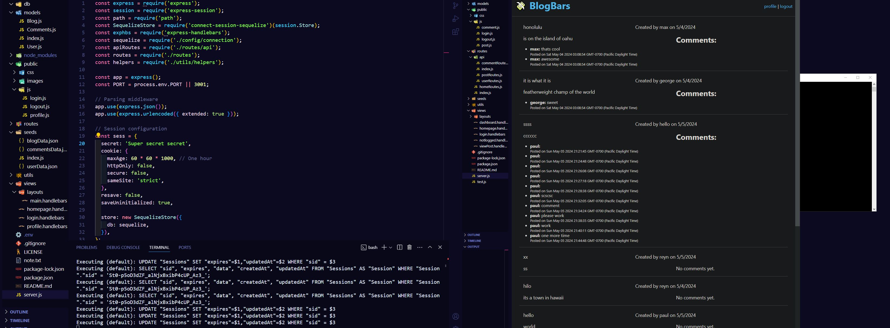

# blogbars

## Description
This application is meant to be a web application for entering blog sites with a sign in and sign up function.

## Installation
insatll nodeJS and postgresql to start, then using npm install pg, sequelize,express-session, express,handlebars,bcrypt and dotenv.  

## Technologies
Javascript
nodeJS
postresql
pg
sequelize
dotenv
express
handlebars
bcrypt
express-session

## Usage
To use this application you first need to sign in or sign up with a password that is at least 6 digits long.  If there are any previous posts they will be rendered on the home page.  Once the login is successful the user can go to their profile and enter a new blog or leave a comment.  If the user goes back to the homepage they should see their blog posts with the title and time it was posted as well as comments if there are any. The user can then click the logout link to logout and go back to the homepage.

## license
See repository for licensing information 

## Credits
Collaborators include: Alicc Madd, Kyle Vance
resources used: MDN, W3 schools, google search

## Lessons Learned
The interaction of the database routes and handlebars is hard to manage at this skill point.  Going step by step and using console logs and organization of micro tasks help very much.

## links

github repo:
https://github.com/RTAKA808/blogbars

screenshot:

